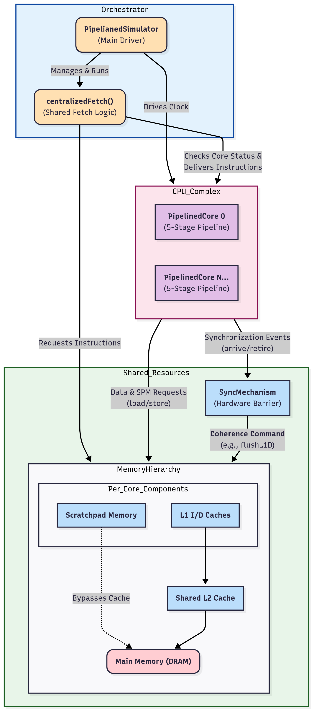

-----


# Multi-Core RISC-V Pipeline & Cache Simulator


## Note:
### Simulator specific test RISC-V codes are in the project.
### Phase 1 and Phase 2 codes are another variant of the Final Phase 3 version. They work, but don't have proper documentation.
---

## 1. Introduction

**This project is an advanced, cycle-accurate simulator for a multi-core RISC-V processor, written in modern C++**. It is designed as an educational and experimental platform for anyone interested in computer architecture. The simulator provides a hands-on environment for exploring the intricate interactions between a pipelined processor, a sophisticated memory hierarchy, and the challenges of multi-core programming.

It models a 5-stage pipeline for each core, a detailed memory system including multi-level caches and scratchpad memory, and hardware support for multi-core synchronization. By allowing users to configure nearly every aspect of the architecture—from data forwarding to cache replacement policies—it serves as a powerful tool for studying the performance implications of various design choices.

## 2. Core Architectural Concepts

This simulator models several fundamental principles of modern computer architecture in detail.




### 2.1 The Pipelined Processor Core

Pipelining is an implementation technique where multiple instructions are overlapped in execution, much like an assembly line. It is the single most important technique for increasing instruction throughput. This simulator implements a classic 5-stage RISC pipeline for each of its cores.

* **Stage 1: Fetch (F)**
    The Fetch (F) stage is the entry point to a core's pipeline, but the fetch itself is handled by a system-level ***centralizedFetch()*** process. This central coordinator requests an instruction from the L1I cache on behalf of a core and delivers it to that core's ***fetchQueue***.

    After the Program Counter (PC) is updated, the core's Decode stage pulls the instruction from this queue on the next cycle. This design cleanly separates the shared task of coordinating instruction fetches from the core's private work of executing the instruction down its pipeline.

* **Stage 2: Decode (D)**
    The fetched instruction is decoded to determine the operation to be performed (e.g., `add`, `lw`). The required operands are read from the integer register file. In this stage, the control unit also generates the necessary signals for the subsequent stages.

* **Stage 3: Execute (E)**
    This is where the main computation occurs. For arithmetic/logic instructions, the Arithmetic Logic Unit (ALU) performs the calculation. For memory instructions like `lw` and `sw`, the ALU calculates the effective memory address by adding the base register and the immediate offset.

* **Stage 4: Memory (M)**
    This stage is primarily for load and store instructions. A ```lw``` instruction reads data by sending a request to the MemoryHierarchy ****facade**** at the address calculated in the Execute stage. Similarly, a ```sw``` instruction sends data to the MemoryHierarchy. The facade is responsible for routing the request to the correct destination (like the L1 Data Cache), but the core itself remains unaware of this internal complexity.

* **Stage 5: Writeback (W)**
    The final stage where the result of an operation is written back into the register file. For an arithmetic instruction, this is the result from the ALU; for a load instruction, this is the data fetched from memory.

#### Pipeline Hazards and Resolution Strategies

While pipelining increases throughput, it introduces **hazards**, which are potential conflicts that prevent the next instruction from executing in the designated clock cycle. This simulator models and resolves these hazards.

* **Data Hazards:** These occur when an instruction's execution depends on the result of a previous, still-in-flight instruction (a "Read-After-Write" dependency).
    * **Problem:** Consider `add x3, x2, x1` followed by `sub x5, x4, x3`. The `sub` instruction needs the new value of `x3` in its Decode/Execute stage, but the `add` instruction only produces it at the end of its Execute stage and writes it back in the Writeback stage. A naive pipeline would have to **stall** (insert bubbles), severely degrading performance.
    * **Solution: Data Forwarding (Bypassing):** This simulator implements comprehensive data forwarding. Special hardware paths are created to route a result directly from the output of one pipeline stage (e.g., the ALU output) to the input of an earlier stage for the next instruction. This allows the `sub` instruction to get the correct value of `x3` without waiting for the `add` to complete its full journey through the pipeline.
    * **The Load-Use Hazard:** One case forwarding cannot fully solve is a dependency on a `lw` instruction. The data loaded from memory is only available at the end of the Memory stage. An instruction needing this data in the very next cycle's Execute stage is one cycle too early. For this specific scenario, the pipeline must stall for one cycle.

* **Control Hazards:** These arise from branch and jump instructions that change the Program Counter. The pipeline fetches instructions sequentially, so if a branch is taken, the instructions that were fetched after the branch are incorrect and must be discarded. This incurs a **branch penalty**.
    * **Solution: Pipeline Flush:** This simulator handles control hazards by assuming branches are "not taken." It continues to fetch sequentially. If the branch condition is resolved in the Execute stage and the branch is indeed taken, the control unit **flushes** the Fetch and Decode stages, discarding the incorrect instructions and restarting the fetch from the correct branch target address.

### 2.2 The Hierarchical Memory System

A major challenge in computer architecture is the **"Memory Wall"**—the ever-growing gap between fast processor speeds and relatively slow main memory access times. The memory hierarchy is the solution to this problem, exploiting the **principle of locality**.

* **Temporal Locality:** If a program accesses a memory location, it is likely to access it again soon.
* **Spatial Locality:** If a program accesses a memory location, it is likely to access nearby locations soon.

This simulator models a detailed and configurable memory hierarchy.

* **Multi-Level Caches:**
    * **L1 Caches:** Small, extremely fast caches private to each core. By splitting the L1 cache into an **Instruction Cache (L1I)** and a **Data Cache (L1D)**, the simulator models a common design (a Harvard architecture) that allows the pipeline to fetch an instruction and load/store data in the same cycle without conflict.
    * **L2 Cache:** A larger, slower, unified cache that is shared by all cores. It acts as a victim cache for the L1s, capturing evicted data and satisfying L1 misses, thereby reducing the number of expensive requests that must go to main memory.

* **Cache Design Parameters in Depth:**
    * **Associativity:** Defines how memory blocks are mapped into the cache. An address is broken into `[Tag | Index | Offset]`. The `Index` bits determine the set, and the `Tag` must match.
        * _Direct-Mapped (1-way):_ Each memory block can only go to one specific cache location. Simple and fast, but suffers from high conflict misses.
        * _N-way Set-Associative:_ Each memory block can go to any of the N locations within a specific set. This is a compromise that significantly reduces conflict misses with manageable complexity.
        * This simulator allows you to configure associativity to study these trade-offs.
    * **Replacement Policies:** When a set is full, a policy decides which block to evict.
        * **LRU (Least Recently Used):** Evicts the block that has been untouched for the longest time. This often yields better performance as it leverages temporal locality, but requires more complex hardware to track usage.
        * **FIFO (First-In, First-Out):** Evicts the block that was brought in first. It is simpler to implement but can perform poorly if an old, frequently used block is evicted.
    * **Write Policies:** This simulator implements a write-through policy for its ```L1``` Data Cache. When a core writes to memory ```sw```, the change is made in the ```L1D``` cache, and the write is immediately propagated to the shared ```L2``` cache. This ensures the ```L2``` cache is always coherent with the ```L1D``` caches. On a write miss, the simulator uses a write-allocate strategy, where the block is first fetched into the ```L1D``` from the ```L2``` before the write is performed.

* **Scratchpad Memory (SPM): A Cache Alternative**
    In contrast to the hardware-managed, probabilistic nature of caches, an SPM is a software-managed, on-chip SRAM. The compiler or programmer is responsible for explicitly moving data into and out of the SPM. This provides **fully predictable, deterministic memory access times**, which is essential for real-time systems where the unpredictable latency of a cache miss would be catastrophic. This simulator models a per-core SPM accessible via dedicated instructions (`lw_spm`, `sw_spm`).

### 2.3 Multi-Core Architecture and Coherence

As single-core performance improvements slowed due to power constraints (the end of Dennard scaling), the industry shifted to multi-core processors. This allows for **Thread-Level Parallelism**, improving overall performance by running multiple tasks in parallel. This, however, introduces the critical **Cache Coherence Problem**.

* **The Coherence Challenge:** Imagine Core 0 reads variable `X` into its private L1D cache. Core 1 does the same. Now, Core 0 writes a new value to `X`. Its L1D is updated (and marked dirty), but Core 1's cache still holds the old, stale value. If Core 1 proceeds to use `X`, it will compute with incorrect data, leading to program failure.

* **Software-Assisted Coherence Protocol:** While commercial processors use complex hardware coherence protocols (like MESI), this simulator models a powerful and intuitive **software-assisted coherence** mechanism using a hardware barrier.
    1.  **Arrival:** A core executes the `sync` instruction. It signals its arrival to the global `SyncMechanism` and stalls its pipeline.
    2.  **Synchronization:** The `SyncMechanism` waits until every core in the system has executed a `sync` instruction.
    3.  **Coherence Action:** Once all cores are synchronized, the system issues a command to perform a write-back and invalidate on all L1 Data caches. This operation forces every core to write its "dirty" blocks to the shared L2 cache and then marks all of its L1D blocks as invalid. This invalidation is critical, as it ensures that future reads will miss in L1 and fetch the newly consistent data from L2.
    4.  **Resumption:** After the flush completes, all cores are released from the barrier and can resume execution, now with access to a consistent view of memory, as any subsequent loads that miss in L1 will fetch the correct, updated data from the L2 cache.

---

## 3. Advanced & Unique Features

Beyond a standard pipeline, this simulator implements several advanced features that provide deeper insight into processor design.

* **Centralized Fetch Unit** 🧠
    Instead of each core's Fetch stage acting independently, this simulator uses a centralized unit that coordinates instruction fetching for all cores in a round-robin fashion. This models a shared front-end resource and allows for more complex fetch logic and arbitration in future extensions.

* **Scratchpad Memory (SPM)** ⚡
    The inclusion of a software-managed Scratchpad Memory for each core is a key feature. It allows for the exploration of memory systems beyond traditional caches, catering to real-time and high-performance computing scenarios where predictable latency is more important than automatic hardware management.

* **Hardware Synchronization Barrier (`sync`)** 🤝
    The `sync` instruction provides a full hardware barrier implementation. This is a powerful, low-level primitive for writing correct parallel programs. It demonstrates a practical approach to enforcing memory consistency and coordinating execution among multiple cores, making it possible to run and analyze sophisticated parallel algorithms.

---

## 4. Configuration & Usage

The simulator offers significant flexibility through runtime configurations.

### 4.1 Runtime Configuration

When you run the simulator, you can configure the following options interactively:

* **Data Forwarding**: You can choose to enable or disable data forwarding. Running the same program with both settings is an excellent way to see the direct impact of forwarding on pipeline stalls and overall IPC.
* **Instruction Latencies**: You can specify custom cycle latencies for individual instructions (e.g., `mul`). If you choose not to, default latencies (typically 1 cycle) will be used.


### 4.2 Configuring the Memory Hierarchy

You will be asked to provide a path to a cache configuration file. If you leave this empty and press Enter, a default configuration will be used. This file allows you to define the entire memory hierarchy.

**Example `cache_config.txt` format:**
```ini
# Cache configuration file
# Sizes are in bytes

# L1 Instruction Cache
L1I_SIZE=16384
L1I_BLOCK_SIZE=64
L1I_ASSOC=2
L1I_LATENCY=1
L1I_POLICY=LRU

# L1 Data Cache
L1D_SIZE=16384
L1D_BLOCK_SIZE=64
L1D_ASSOC=4
L1D_LATENCY=1
L1D_POLICY=LRU

# L2 Unified Cache
L2_SIZE=262144
L2_BLOCK_SIZE=64
L2_ASSOC=8
L2_LATENCY=10
L2_POLICY=FIFO

# Scratchpad Memory
SPM_SIZE=16384
SPM_LATENCY=1

# Main Memory
MEM_LATENCY=100
```

### 4.3 Loading an Assembly Program

The simulator will prompt you to enter the path to a RISC-V assembly file. This file should contain the program to be executed, written using the supported ISA.

---

## 5. Supported ISA

The simulator parses and executes a subset of the RISC-V instruction set.

| Type | Instructions |
| :--- | :--- |
| **Arithmetic**| `add`, `sub`, `mul`, `slt`, `addi` |
| **Memory** | `lw`, `sw` (Cache/DRAM), `la` |
| **SPM** | `lw_spm`, `sw_spm` (Scratchpad) |
| **Control** | `beq`, `bne`, `blt`, `jal` |
| **Sync** | `sync` (Barrier) |
| **System** | `halt` |

*The register `x31` is hard-wired to return the core's ID.*

## Note on ```beq```: 
* This simulator supports **a special variant** for multi-core control: ```beq x31, <core_id>, <label>```. This instruction acts as a dispatch, where only the core matching <core_id> will take the branch.
---


## 6. Output and Analysis

The simulator provides rich output for thorough analysis. The console includes verbose debug statements during execution, which are useful for tracing complex interactions.

### Final State and Statistics

Upon halting, the simulator prints a complete report to the console.

* **Register Dump**: The final state of all 32 registers for each core. `x0` is always 0, and `x31` holds the core's ID.
* **Memory Dump**: Memory Dump: The contents of the main memory (**4096 bytes / 4 KB** by default), formatted for readability.
    ```text
    00000000: 00000009 00000001 00000002 00000005
    00000010: 00000008 00000000 00000000 00000000
    ```

* **Pipeline Statistics**: Per-core and overall performance metrics.
    ```text
    === Pipeline Statistics ===
    Core 0:
      Instructions executed: 150
      Cycles: 429
      Total stalls: 407
      Memory stalls: 155
      IPC: 0.35
    ... (for each core) ...

    Overall Statistics:
      Total instructions: 600
      Total cycles: 429
      Total stalls: 1628
      Memory stalls: 620 (38.1% of all stalls)
      Overall IPC: 1.40

    Forwarding: Disabled
    Instruction Latencies:
      add: 1 cycle(s)
      addi: 1 cycle(s)
      mul: 1 cycle(s)
      slt: 1 cycle(s)
      sub: 1 cycle(s)
    ```

* **Memory Hierarchy Statistics**: A detailed breakdown of cache performance.
    ```text
    === Memory Hierarchy Statistics ===

    L1I Caches:
      Core 0: Accesses=176, Hits=175, Misses=1, Hit Rate=99.43%
      ... (for each core) ...
      Overall L1I Hit Rate: 99.43%

    L1D Caches:
      Core 0: Accesses=25, Hits=20, Misses=5, Hit Rate=80.00%
      ... (for each core) ...
      Overall L1D Hit Rate: 80.00%

    L2 Cache:
      Accesses=24, Hits=19, Misses=5, Hit Rate=79.17%

    Overall Cache Miss Rates:
      L1I Miss Rate: 0.57%
      L1D Miss Rate: 20.00%
      L2 Miss Rate: 20.83%
    ```

### Pipeline Trace File (`.csv`)

For each run, the simulator generates a `pipeline_core_N.csv` file for each core. When opened in a spreadsheet program like Excel, this file provides a clear visualization of the pipeline's execution, showing the stage of each instruction at every clock cycle. This is invaluable for debugging and understanding pipeline flow, stalls, and flushes.

---


## Build Instructions

### 🧠 Requirements

* C++17 compatible compiler (GCC ≥ 7.0 or Clang ≥ 5.0)
* CMake ≥ 3.15

---

### 📥 Clone the Repository

```bash
git clone https://github.com/sathvik1610/RISC-V-Simulator
cd RISC-V-Simulator/RISC-V-Simulator-main/Phase_3
```

---

### 🧰 CLion

1. Open CLion.
2. Select `RISC-V-Simulator-main/Phase_3` as the project folder.
3. CLion will auto-detect the `CMakeLists.txt` file and configure the project.
4. Use the green ▶️ button to build and run the project.

---

### 💻 VS Code

1. Open `RISC-V-Simulator-main/Phase_3` in VS Code:

   ```bash
   code RISC-V-Simulator-main/Phase_3
   ```

2. Create a build directory:

   ```bash
   mkdir build && cd build
   ```

3. Configure the project with CMake:

   ```bash
   cmake ..
   ```

4. Build the project:

   ```bash
   cmake --build .
   ```

5. Run the simulator:

   ```bash
   ./project      # Linux/macOS
   project.exe    # Windows
   ```


